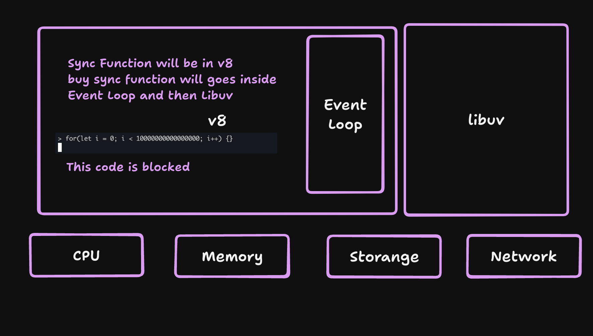

In Node.js, the main thread and worker threads are key concepts that help manage execution of tasks efficiently. Let’s break it down:

1. Main Thread

	•	Definition: The main thread is the single thread where Node.js executes JavaScript code in the event loop.
	•	Purpose: It handles all the operations such as:
	•	Executing JavaScript code.
	•	Processing callbacks, promises, and events.
	•	Orchestrating asynchronous tasks like I/O operations.
	•	Characteristics:
	•	Single-threaded: Node.js runs JavaScript code in a single main thread.
	•	Non-blocking: The event loop ensures I/O-bound tasks don’t block the thread.
	•	CPU-intensive tasks can block the main thread, leading to performance issues.

2. Worker Threads

	•	Definition: Worker threads allow you to execute JavaScript code in separate threads, enabling parallel execution of CPU-intensive tasks.
	•	Purpose:
	•	To offload CPU-bound or computationally heavy tasks.
	•	To prevent blocking the main thread and keep the application responsive.
	•	Introduced: Available since Node.js 10.5.0 (stable since 12.x).
	•	Characteristics:
	•	Each worker thread runs independently with its own event loop.
	•	Memory is not shared directly; communication happens via message-passing or SharedArrayBuffer.
    •   Creates a new thread from main thread

Example: Using Worker Threads

Here’s how worker threads can be used to offload heavy computations:

Main Thread

const { Worker } = require('worker_threads');

// Function to create a worker thread
function runWorkerTask() {
    return new Promise((resolve, reject) => {
        const worker = new Worker('./worker.js'); // Worker script
        worker.on('message', resolve); // Receive result
        worker.on('error', reject); // Handle error
        worker.on('exit', (code) => {
            if (code !== 0) {
                reject(new Error(`Worker stopped with exit code ${code}`));
            }
        });
    });
}

// Use the worker thread
runWorkerTask().then((result) => {
    console.log('Result from worker:', result);
}).catch((err) => {
    console.error('Worker error:', err);
});

console.log('Main thread is not blocked!');

Worker Thread Script (worker.js)

const { parentPort } = require('worker_threads');

// Simulate a heavy computation
let sum = 0;
for (let i = 0; i < 1e9; i++) {
    sum += i;
}

// Send the result back to the main thread
parentPort.postMessage(sum);

Output

Main thread is not blocked!
Result from worker: 499999999500000000

Explanation

	1.	The main thread remains responsive and processes other tasks while the worker thread runs the heavy computation.
	2.	Once the worker thread completes, it sends the result to the main thread.

When to Use Worker Threads

	•	For CPU-intensive tasks like:
	•	Image or video processing.
	•	Complex mathematical computations.
	•	Parsing large datasets.
	•	Cryptography (e.g., hashing, encryption).
	•	Not recommended for I/O-bound tasks because Node.js’s built-in async I/O is already efficient.

By utilizing worker threads, you can handle computationally expensive operations in parallel without impacting the main thread’s performance.

### How Many Worker Threads Can Be Created?

The number of threads you can create depends on:
	1.	Hardware: The number of CPU cores and available memory.
	2.	Node.js Limits: Node.js does not impose a strict limit on the number of threads, but too many threads may exhaust system resources.